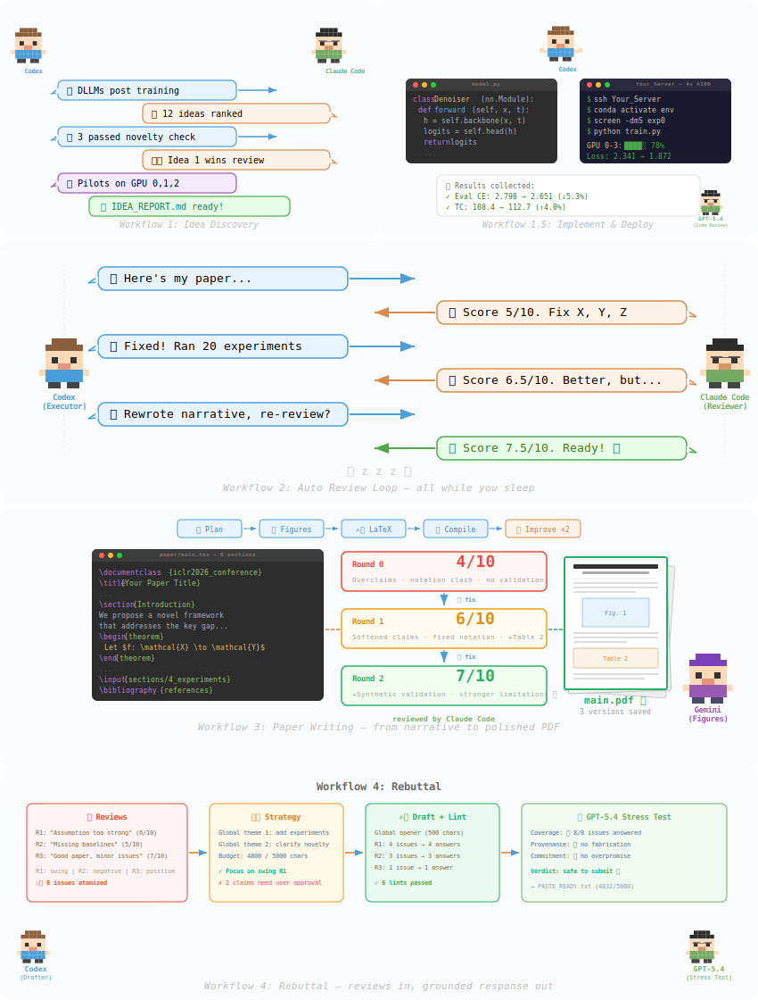

# Auto-claude-code-research-in-sleep (ARIS)




> 本文档是 ARIS 当前唯一的中文主手册。
>
> 当前仓库只文档化一条公开主线：
> **Codex 负责执行**，**Claude Code CLI 负责审稿**，两者通过本地 `claude-review` MCP bridge 连接。
>
> 如果你第一次接触这个项目，先读这份 README；如果你想看一个真实研究方向如何落地，再读 [`docs/INERTIAL_ODOMETRY_GUIDE_CN.md`](docs/INERTIAL_ODOMETRY_GUIDE_CN.md)。

---

## 目录

1. [项目定位](#1-项目定位)
2. [主线组成](#2-主线组成)
3. [安装验证重装与卸载](#3-安装验证重装与卸载)
4. [项目初始化](#4-项目初始化)
5. [Codex 主线工作流](#5-codex-主线工作流)
6. [Research Wiki / Deep Innovation / Meta Optimize](#6-research-wiki--deep-innovation--meta-optimize)
7. [远程实验与监控](#7-远程实验与监控)
8. [会话恢复与关键文件](#8-会话恢复与关键文件)
9. [常用命令速查](#9-常用命令速查)
10. [维护者检查](#10-维护者检查)
11. [保留文档与常见问题](#11-保留文档与常见问题)

---

## 1. 项目定位

ARIS 不是一个 Web 平台，也不是一个绑定单一模型厂商的框架。它更接近一个科研工作流 harness：

- 用 `SKILL.md` 把科研流程拆成可复用阶段
- 用 Codex 处理代码修改、实验执行、文件维护与项目状态推进
- 用独立审稿器做外部评估，而不是让执行器自审
- 用 Markdown/JSON 工件保存长期状态，支持跨会话恢复

当前仓库默认分工固定为：

- 执行器：Codex CLI
- 审稿器：Claude Code CLI
- 传输层：`claude-review` MCP server

这条主线要串起来的是一整条科研链路，而不是一句 prompt：

1. 文献调研与方向收敛
2. idea 生成、筛选和查新
3. 方法精炼与实验计划
4. 实现、部署与初轮实验
5. 深度方法进化或快速 review polish
6. 从结果抽取 claim
7. 论文写作
8. rebuttal / slides / poster

---

## 2. 主线组成

当前主线由三部分组成：

- 基础执行技能包：[`skills/skills-codex/`](skills/skills-codex/)
- Claude 审稿覆盖层：[`skills/skills-codex-claude-review/`](skills/skills-codex-claude-review/)
- 审稿 bridge：[`mcp-servers/claude-review/`](mcp-servers/claude-review/)

安装顺序固定为：

1. 先安装 `skills/skills-codex/*`
2. 再叠加 `skills/skills-codex-claude-review/*`
3. 最后注册 `claude-review` MCP

仓库已经提供了完整安装链：

- 安装脚本：[`scripts/install_codex_claude_mainline.sh`](scripts/install_codex_claude_mainline.sh)
- 卸载脚本：[`scripts/uninstall_codex_claude_mainline.sh`](scripts/uninstall_codex_claude_mainline.sh)
- 冒烟测试：[`scripts/smoke_test_codex_claude_mainline.sh`](scripts/smoke_test_codex_claude_mainline.sh)

主线维护说明只保留两份：

- [`docs/CODEX_CLAUDE_REVIEW_GUIDE_CN.md`](docs/CODEX_CLAUDE_REVIEW_GUIDE_CN.md)
- [`docs/CODEX_MAINLINE_PARITY_RULES_CN.md`](docs/CODEX_MAINLINE_PARITY_RULES_CN.md)

其中：

- `CODEX_CLAUDE_REVIEW_GUIDE_CN.md` 解释主线分层、overlay、bridge 和维护链
- `CODEX_MAINLINE_PARITY_RULES_CN.md` 是“主线不回退”的审查基线

当前主线还有三个必须理解清楚的内建层：

- `research-wiki`：长期研究记忆层
- `deep-innovation-loop`：默认主线中的方法进化阶段
- `meta-optimize`：阶段结束后的维护环

它们已经进入主线叙事，不再是边缘附件。

---

## 3. 安装验证重装与卸载

### 3.1 环境准备

建议先确认本机具备：

- `git`
- `node` / `npm`
- `python3`
- `codex`
- `claude`

安装 Codex 与 Claude Code CLI：

```bash
npm install -g @openai/codex @anthropic-ai/claude-code
codex setup
```

验证：

```bash
codex --version
claude --version
python3 --version
```

主线安装只负责把技能包和 reviewer bridge 放到位，不负责替你完成 Claude CLI 登录。安装前先确认：

```bash
claude -p "Reply with exactly READY" --output-format json --tools ""
```

如果你的 Claude 访问依赖代理，先在当前 shell 里导出对应的代理环境变量，再运行安装器。安装器会默认把这些代理变量一并写入 `claude-review` 的 MCP 配置。

### 3.2 首次安装

```bash
git clone https://github.com/wanshuiyin/Auto-claude-code-research-in-sleep.git
cd Auto-claude-code-research-in-sleep
bash scripts/install_codex_claude_mainline.sh
```

安装器会：

- 拷贝 `skills/skills-codex/*` 到 `~/.codex/skills/`
- 叠加 `skills/skills-codex-claude-review/*`
- 安装 `mcp-servers/claude-review/server.py`
- 注册 `claude-review` MCP
- 自动继承当前 shell 中已有的常见代理环境变量到 `claude-review` MCP
- 写入安装 manifest
- 复制本地可执行卸载脚本到 `~/.codex/.aris/codex-claude-mainline/`

### 3.3 安装后验证

先检查 MCP：

```bash
codex mcp list
codex mcp get claude-review --json
```

再检查 Claude CLI：

```bash
claude -p "Reply with exactly READY" --output-format json --tools ""
```

最后跑一次运行时健康检查：

```bash
bash scripts/check_claude_review_runtime.sh
```

这个检查会覆盖四层：

- Claude CLI 直连
- 直接启动 bridge
- 已安装的 `claude-review` MCP
- 宿主机 `Codex -> mcp__claude_review__review`

如果 direct CLI 正常、但已安装 MCP 失败，而且当前 shell 里存在代理变量而 MCP 配置里缺失，脚本会提示重新执行安装器。

然后进入你的项目目录启动 Codex：

```bash
codex -C /path/to/your/project
```

如果安装成功，你应该能使用这些主线技能：

- `/idea-discovery`
- `/experiment-bridge`
- `/deep-innovation-loop`
- `/auto-review-loop`
- `/paper-writing`
- `/rebuttal`

### 3.4 固定审稿模型

```bash
bash scripts/install_codex_claude_mainline.sh \
  --reinstall \
  --review-model 'claude-opus-4-6[1m]' \
  --review-fallback-model 'claude-opus-4-6'
```

默认情况下，`claude-review` 会优先使用 `claude-opus-4-6[1m]`，失败时回退到 `claude-opus-4-6`。这个回退只对未显式传 `model` 的 reviewer 调用生效。

安装器默认也会把当前 shell 中已有的代理变量写入 `claude-review` MCP。如果你明确不希望这样做，可以加：

```bash
--no-inherit-proxy-env
```

### 3.5 使用 AWS wrapper

如果你的 Claude CLI 依赖 wrapper：

```bash
bash scripts/install_codex_claude_mainline.sh --reinstall --use-aws-wrapper
```

### 3.6 重装

安装器默认拒绝覆盖已有主线安装。需要显式带上 `--reinstall`：

```bash
bash scripts/install_codex_claude_mainline.sh --reinstall
```

### 3.7 卸载

优先使用安装器复制到本地状态目录的卸载脚本：

```bash
bash ~/.codex/.aris/codex-claude-mainline/uninstall_codex_claude_mainline.sh
```

这个脚本会：

- 删除安装器注册的 `claude-review` MCP
- 按 manifest 精确回滚安装器接管过的路径
- 恢复安装前备份
- 清理本地安装状态目录

也就是说，它不是粗暴删除整个 `~/.codex/skills`，而是精确卸载。

### 3.8 维护者冒烟测试

如果你修改过安装器、overlay 或 bridge，建议运行：

```bash
bash scripts/smoke_test_codex_claude_mainline.sh
bash scripts/check_claude_review_runtime.sh
```

---

## 4. 项目初始化

### 4.1 创建研究项目

```bash
mkdir ~/my-research-project
cd ~/my-research-project
git init
codex -C .
```

### 4.2 使用 `CODEX.md` 作为唯一项目主配置

当前 Codex 主线只认项目根目录的 `CODEX.md`。

一个最小可用模板如下：

```markdown
# Project Overview

## Research Direction
- Topic: 你的研究方向
- Target venue: ICLR / ICML / NeurIPS / CVPR / ACL / AAAI / IEEE_JOURNAL / IEEE_CONF
- Main baseline: 你的主基线

## GPU Configuration
- gpu: local

## Notes
- Key metrics: 你关心的指标
- Constraints: 计算预算、数据限制、上线约束

## Pipeline Status
stage: init
idea: ""
contract: docs/research_contract.md
current_branch: main
baseline: ""
training_status: idle
active_tasks: []
next: run /idea-discovery
```

如果你要配置远程 GPU，可以把 GPU 段写得更具体：

```markdown
## GPU Configuration
- gpu: remote
- ssh_alias: my-server
- conda_env: research
- code_dir: ~/my-research-project
```

### 4.3 编写 `RESEARCH_BRIEF.md`

`RESEARCH_BRIEF.md` 负责放研究背景、约束、资源和你已知的信息。很多工作流会自动把它当作研究上下文。

建议最少包含：

- 研究问题
- 当前痛点
- 已知基线
- 数据与资源
- 你做过的尝试
- 明确不做什么

模板见：

- [`templates/RESEARCH_BRIEF_TEMPLATE.md`](templates/RESEARCH_BRIEF_TEMPLATE.md)

### 4.4 选定 idea 之后的 `research_contract`

当你完成 `/idea-discovery` 并真正进入实现阶段后，建议把当前选中的 idea 收敛到：

- `docs/research_contract.md`

模板见：

- [`templates/RESEARCH_CONTRACT_TEMPLATE.md`](templates/RESEARCH_CONTRACT_TEMPLATE.md)

这份文件的作用是让新会话不必重新阅读整份 `IDEA_REPORT.md`，而是直接回到“当前正在做的那个 idea”。

### 4.5 推荐目录

不是硬性要求，但实践中下面这个结构最顺手：

```text
project/
├── CODEX.md
├── RESEARCH_BRIEF.md
├── docs/
│   └── research_contract.md
├── papers/
├── literature/
├── src/
├── scripts/
├── results/
├── paper/
└── rebuttal/
```

---

## 5. Codex 主线工作流

当前最推荐的实际使用方式是模块化串联，而不是一上来把所有事情交给一条超长命令。

所有会改代码的执行型 workflow 现在都共享两条硬协议：

- **Mandatory Test Gate**：每次写完代码后，先过模块测试和 workflow smoke test，再允许部署、复审或进入下一轮
- **Reviewer Resolution Protocol**：每条 reviewer 反馈都要分类为 accepted / narrowed / rebutted / unresolved；有争议时必须带证据回同一 reviewer thread 讨论直到收敛

### 5.1 推荐主流程

1. `/idea-discovery`
2. `/research-refine-pipeline`
3. `/experiment-bridge`
4. `/run-experiment`
5. 创新 gate 决定进入 `/deep-innovation-loop` 或直接 `/auto-review-loop`
6. `/result-to-claim`
7. `/paper-writing`
8. `/rebuttal` / `/paper-slides` / `/paper-poster`

### 5.2 一键总入口

如果你想先跑一条主干全流程，可以使用：

```text
/research-pipeline "你的研究方向"
```

当前这条技能的实际主链路是：

```text
/idea-discovery
-> /research-refine-pipeline
-> implement
-> /run-experiment
-> innovation gate
-> /deep-innovation-loop?
-> /auto-review-loop
-> submission-ready
```

默认行为需要特别注意：

- `RESEARCH_WIKI: auto`
- `DEEP_INNOVATION: auto`
- `META_OPTIMIZE: false`

也就是说：

- 如果 `research-wiki/` 已存在，主线会把它接进来
- 初轮实验后会自动判断是否进入 `deep-innovation-loop`
- `meta-optimize` 默认不会自动插进研究主线

### 5.3 各阶段要点

阶段一 `idea-discovery`

- 负责文献调研、idea 生成、查新、外部审稿和初步方法收敛
- 主要产物：
  - `IDEA_REPORT.md`
  - `refine-logs/FINAL_PROPOSAL.md`
  - `refine-logs/EXPERIMENT_PLAN.md`
  - `refine-logs/EXPERIMENT_TRACKER.md`

阶段二 `research-refine-pipeline`

- 负责把模糊想法收敛成一条清晰方法线，再补齐 claim-driven experiment plan
- 这是把“idea 看起来不错”推进到“实验可以开始写代码”的关键阶段

阶段三 `experiment-bridge`

- 读取实验计划、实现代码、做本地审查、通过 Mandatory Test Gate、部署实验、收集初轮结果
- 它是研究规划和工程执行之间的桥

阶段四 `deep-innovation-loop` 与 `auto-review-loop`

- `deep-innovation-loop` 处理结构性问题和方法进化
- `auto-review-loop` 处理多轮 reviewer feedback、争议收敛、修复、测试与复审
- 两者不是互斥关系。当前主线通常是：
  初轮实验后先判断是否需要深度方法进化，然后再进入最终 review polish

阶段五 `paper-writing`

- 主链路：
  `/paper-plan -> /paper-figure -> /paper-write -> /paper-compile -> /auto-paper-improvement-loop`

阶段六 `rebuttal / slides / poster`

- 在论文定稿后继续向投稿后工作流推进
- 不强制自动进入，建议显式触发

---

## 6. Research Wiki / Deep Innovation / Meta Optimize

### 6.1 Research Wiki

`research-wiki` 是主线长期研究记忆层，不是额外笔记本。

推荐嵌入方式：

1. 在 `CODEX.md` 和 `RESEARCH_BRIEF.md` 稳定后执行：
   ```text
   /research-wiki init
   ```
2. 让 `/research-lit` 把核心论文写进 `research-wiki/papers/`
3. 让 `/idea-creator` 在 ideation 前读取 `query_pack.md`，在 ideation 后把推荐与淘汰的 idea 回写 wiki
4. 让 `/result-to-claim` 在结果判定后把 experiment / claim / failure notes 回写 wiki
5. 在长会话切换或重新找 idea 前，手动使用：
   ```text
   /research-wiki query "你的主题"
   /research-wiki stats
   /research-wiki lint
   ```

### 6.2 Deep Innovation Loop

`deep-innovation-loop` 已经进入当前默认主线。

当前默认语义：

- `DEEP_INNOVATION: auto`
- 初轮实验后会自动做一次 innovation gate
- 如果问题是结构性的，主线进入 `deep-innovation-loop`
- 如果问题主要是 reviewer polish，主线直接进入 `auto-review-loop`

你仍然可以显式覆盖：

- `DEEP_INNOVATION: true`
- `DEEP_INNOVATION: false`

### 6.3 Meta Optimize

`/meta-optimize` 更适合被理解为主线之后的维护环，而不是研究执行阶段里的必经步骤。

推荐嵌入方式：

1. 先让主线真正跑出工件：
   - `AUTO_REVIEW.md`
   - `innovation-logs/`
   - `refine-logs/`
   - `findings.md`
   - `paper/`
   - `rebuttal/`
2. 然后在阶段边界运行：
   ```text
   /meta-optimize "research-pipeline"
   /meta-optimize "auto-review-loop"
   /meta-optimize "deep-innovation-loop"
   /meta-optimize "paper-writing"
   ```
3. 它会优先分析实际工件；如果你另外收集了 `.aris/meta/events.jsonl`，也会把事件日志作为增强证据
4. 只有在你明确执行 `apply` 时，才应该让它改 harness

---

## 7. 远程实验与监控

如果你计划让 ARIS 自动跑实验，通常还需要：

- 可用 GPU
- SSH 连接
- 远程 Python/conda 环境
- `screen` 或 `tmux`

这些不是安装 ARIS 的硬前提，但会直接影响 `/run-experiment`、`/monitor-experiment`、`/experiment-bridge` 的执行质量。

### 7.1 最小远程执行路径

```text
/experiment-bridge "refine-logs/EXPERIMENT_PLAN.md"
/run-experiment "你的训练命令"
/monitor-experiment "server-name"
```

### 7.2 可选 watchdog

如果你有长时间后台训练，建议把 `tools/watchdog.py` 部署到远程服务器做持续监控。

最小启动方式：

```bash
screen -dmS watchdog python3 tools/watchdog.py
```

或：

```bash
tmux new-session -d -s watchdog "python3 tools/watchdog.py"
```

`watchdog.py` 不是主线安装前提，但它能持续监控 session 存活、GPU 空闲和下载停滞，适合过夜任务。

---

## 8. 会话恢复与关键文件

ARIS 的长流程一定会遇到两个问题：

1. 上下文压缩
2. 新会话接力

当前主线最重要的恢复约定只有一个：

- 在项目根目录维护 `CODEX.md`
- 在 `CODEX.md` 中维护 `## Pipeline Status`

### 8.1 推荐写法

```yaml
## Pipeline Status
stage: training
idea: "一句话说明当前 idea"
contract: docs/research_contract.md
current_branch: feature/current-idea
baseline: "baseline metric = 0.82"
training_status: running on server-a, gpu 0-3, tmux=train01
active_tasks:
  - "exp01 on server-a"
next: wait for results and run /auto-review-loop
```

### 8.2 什么时候更新

至少在这些时刻更新：

- 阶段切换
- 选定 idea
- 启动或结束训练
- 做出关键方法决策
- 你准备切会话、压缩上下文、收工之前

### 8.3 关键输出物

| 文件或目录 | 作用 |
|------------|------|
| `CODEX.md` | 项目主配置与 `Pipeline Status` |
| `RESEARCH_BRIEF.md` | 研究背景、目标、限制、资源 |
| `docs/research_contract.md` | 当前 idea 的聚焦上下文 |
| `IDEA_REPORT.md` | 阶段一 idea 总报告 |
| `IDEA_CANDIDATES.md` | compact 模式下的 idea 摘要 |
| `refine-logs/FINAL_PROPOSAL.md` | 固化后的方法提案 |
| `refine-logs/EXPERIMENT_PLAN.md` | 结构化实验路线图 |
| `refine-logs/EXPERIMENT_TRACKER.md` | 实验执行与状态跟踪 |
| `AUTO_REVIEW.md` | 自动审稿日志 |
| `REVIEW_STATE.json` | 自动审稿恢复状态 |
| `innovation-logs/` | 深度创新循环状态、技术库与轮次记录 |
| `paper/` | 论文 LaTeX 与编译产物 |
| `rebuttal/` | rebuttal 工件 |
| `research-wiki/` | 研究知识图谱 |

除了 `CODEX.md`，这些文件也会帮助恢复现场，但它们不能替代 `Pipeline Status`。

---

## 9. 常用命令速查

安装主线：

```bash
bash scripts/install_codex_claude_mainline.sh
```

卸载主线：

```bash
bash ~/.codex/.aris/codex-claude-mainline/uninstall_codex_claude_mainline.sh
```

一键主线：

```text
/research-pipeline "你的研究方向"
```

按阶段运行：

```text
/idea-discovery "你的研究方向"
/research-refine-pipeline "你的研究方向"
/experiment-bridge "refine-logs/EXPERIMENT_PLAN.md"
/deep-innovation-loop "你的主题 — baseline: your-baseline, venue: your-venue"
/auto-review-loop "你的主题"
/paper-writing "NARRATIVE_REPORT.md"
/rebuttal "paper/"
```

Research Wiki：

```text
/research-wiki init
/research-wiki ingest "paper title"
/research-wiki query "topic"
/research-wiki lint
/research-wiki stats
```

Meta Optimize：

```text
/meta-optimize "research-pipeline"
/meta-optimize "auto-review-loop"
/meta-optimize apply 1
```

---

## 10. 维护者检查

如果你修改了主线 skill、overlay、安装器或 bridge，至少跑这五条：

```bash
python3 tools/check_codex_mainline_parity.py
python3 tools/generate_codex_claude_review_overrides.py
git diff --check
bash scripts/smoke_test_codex_claude_mainline.sh
bash scripts/check_claude_review_runtime.sh
```

推荐顺序：

1. 先跑 `check_codex_mainline_parity.py`
2. 再重生 overlay
3. 再看 `git diff --check`
4. 先跑安装链 smoke test
5. 最后跑真实 runtime 健康检查

如果你在维护主线，而不是单纯使用主线，再配合阅读：

- [`docs/CODEX_CLAUDE_REVIEW_GUIDE_CN.md`](docs/CODEX_CLAUDE_REVIEW_GUIDE_CN.md)
- [`docs/CODEX_MAINLINE_PARITY_RULES_CN.md`](docs/CODEX_MAINLINE_PARITY_RULES_CN.md)

---

## 11. 保留文档与常见问题

### 11.1 当前保留的主线文档

- 主手册：[`README.md`](README.md)
- 主线维护说明：[`docs/CODEX_CLAUDE_REVIEW_GUIDE_CN.md`](docs/CODEX_CLAUDE_REVIEW_GUIDE_CN.md)
- 主线不回退基线：[`docs/CODEX_MAINLINE_PARITY_RULES_CN.md`](docs/CODEX_MAINLINE_PARITY_RULES_CN.md)
- 领域化落地示例：[`docs/INERTIAL_ODOMETRY_GUIDE_CN.md`](docs/INERTIAL_ODOMETRY_GUIDE_CN.md)

仓库不再维护 Gemini、MiniMax、其他宿主适配和 API 混搭分支的公开长文档；公开文档面只围绕当前 Codex 主线收敛。

不过仓库仍保留两条可选 reviewer 支路代码：

- `skills/skills-codex-gemini-review/` + `mcp-servers/gemini-review/`
- `skills/skills-codex/auto-review-loop-minimax/` + `mcp-servers/minimax-chat/`

它们不是默认主线，也不参与默认安装脚本；同时它们也统一按 Codex 命名维护，不再保留旧的 Claude-era 路径或历史配置文件兼容语义。

### 11.2 我应该写哪个项目配置文件？

直接写 `CODEX.md`。当前主线只把它当作项目配置入口。

### 11.3 安装成功了，但看不到技能

先查三件事：

1. `~/.codex/skills/` 下是否有对应目录
2. `codex mcp get claude-review --json` 是否正常
3. 是否曾有旧 ARIS / 旧 MCP 配置干扰

必要时执行：

```bash
bash scripts/install_codex_claude_mainline.sh --reinstall
```

### 11.4 `deep-innovation-loop` 在不在主线里？

在。安装主线就会一起安装，也已经进入当前 `/research-pipeline` 的默认主线；默认行为是 `DEEP_INNOVATION: auto`。

### 11.5 不想全自动，能半自动吗？

可以。很多工作流都有：

- `AUTO_PROCEED: false`
- `HUMAN_CHECKPOINT: true`

你可以只把最费时间的阶段交给 ARIS，把关键决策点留给自己。

### 11.6 第一次跑 ARIS，最短路径是什么？

建议按这个顺序：

1. 安装主线
2. 在项目里写 `CODEX.md`
3. 可选补一份 `RESEARCH_BRIEF.md`
4. 先跑 `/idea-discovery`
5. 再跑 `/experiment-bridge`
6. 做初轮实验
7. 让主线决定是否进入 `/deep-innovation-loop`
8. 用 `/auto-review-loop` 收尾
9. 有论文叙事后再进入 `/paper-writing`
10. 有足够工件后再用 `/meta-optimize` 做维护优化
